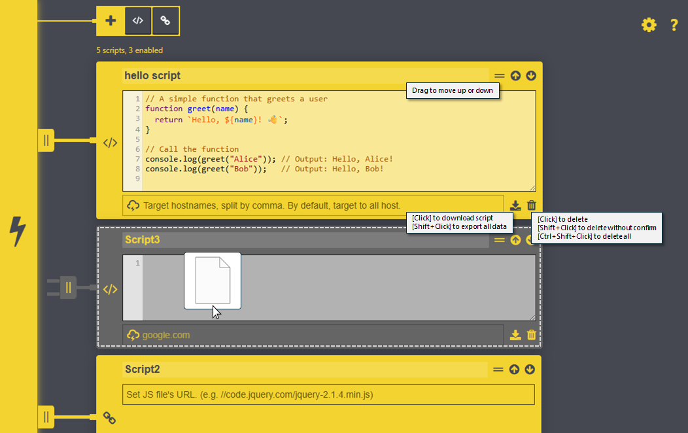

<!-- # ⚠️ This extension relies on features that are no longer supported under [Manifest V3](https://developer.chrome.com/docs/extensions/develop/migrate/what-is-mv3). As a result, it can no longer be used or maintained. Thank you for using this extension for such a long time👋 -->

# ScriptAutoRunner3

**ScriptAutoRunner3** is a fork of the original [ScriptAutoRunner](https://github.com/nakajmg/ScriptAutoRunner), updated to work under **Chrome Manifest V3**.  

The original extension relied on features no longer supported in MV3 and could not be maintained further. This fork brings the same familiar functionality back, adapted to the new extension platform.

---

## What’s New in ScriptAutoRunner3

- **Manifest V3 support**  
  Migrated the extension to comply with MV3 requirements.  

- **Switched from Vue.js 1.0 to vanilla JavaScript**  
  The legacy Vue 1.0 framework is no longer used.  
  Functionality was rewritten in plain JavaScript for long-term maintainability and compatibility.  
  Effort was made to keep the behavior and interface as close as possible to the original.  

- **Manifest and API updates**  
  Adjusted background scripts, permissions, and other extension internals to meet MV3 standards.  

- **Keeping it simple**  
  Familiar workflow preserved — designed as a drop-in replacement for the original extension.  
  Lightweight, dependency-free (no Vue.js required).  

- **New features for improved UI and usability**  
  - Added colored syntax highlighting for JavaScript code.  
  - Added drag-and-drop support for easy import of .js files.  
  - Added button for script dowload or full data export.  
  - Added drag-and-drop support for moving and rearranging scripts.
  - Added deletion options with key combinations on delete button.  
  - UI/UX visual improvements and bugfixes.  



---

## Acknowledgments

Huge thanks to [**nakajmg**](https://github.com/nakajmg) for creating the original **ScriptAutoRunner** and maintaining it for so long.  
This project simply adapts that excellent work for Manifest V3 while keeping the same spirit of simplicity and functionality alive. Some new extra features are introduced as well.

---

## Keeping the same good old features from the original repo

Injects to any Script into a Website. It can be autorun as well.


## Install

Download & install from Chrome Webstore. [Manifest v2 deprecated]

[Download](https://chrome.google.com/webstore/detail/scriptautorunner/gpgjofmpmjjopcogjgdldidobhmjmdbm)

## Feature

* Injects external JavaScript library by URL 
* Injects snippet by your own code then

Also injected Scripts are executed automatically.


## Usage

Manage Scripts on options page.

Open from popup or [chrome://extensions/](chrome://extensions/).


### Add library

Click link icon. Then you write file's URL.


### Add Snippet

Click code icon. Then you write your own code.


### Filter by hostname.

By default, Scripts are executed all Website.

You can manage executed Scripts by hostname.

Expected value is String or Array(split by comma).

```
github.io, github.com
```


### Temporary disable

When you would like to disable Scripts temporary.

You can manage Scripts on options and popup.

Click plug icon then toggle enable/disable.


